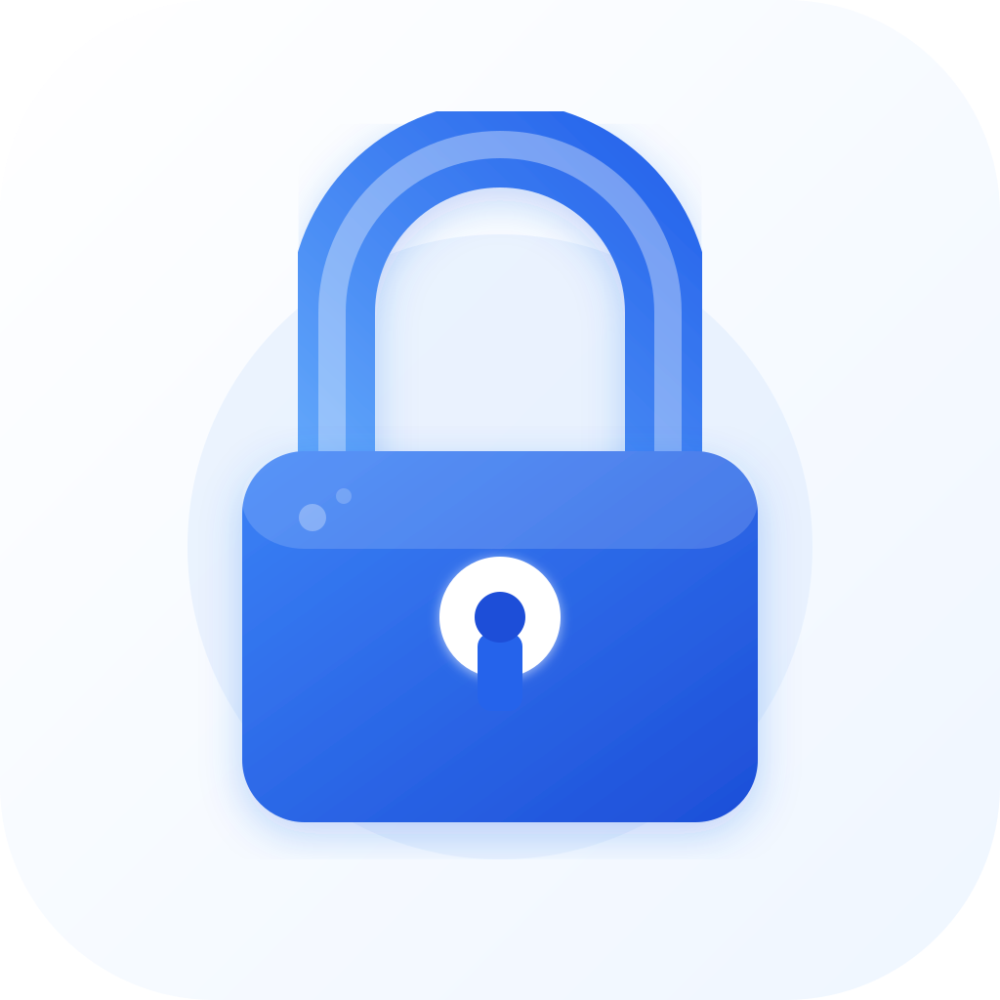

<p align="center">
  
</p>

<h1 align="center">Personal Data</h1>

<p align="center">
  A secure, offline-first desktop application for managing your sensitive personal information.
  <br />
  Passwords · Notes · To-Do Reminders · Bank Accounts · Investments
</p>

<p align="center">
  
  
  
  
  
</p>

---

## Table of Contents

-   [Overview](#overview)
-   [Features](#features)
-   [Installation](#installation)
    -   [macOS](#macos)
    -   [Windows](#windows)
    -   [Linux](#linux)
-   [Build from Source](#build-from-source)
    -   [Prerequisites](#prerequisites)
    -   [Setup](#setup)
    -   [Development](#development)
    -   [Building Distributables](#building-distributables)
-   [Data Storage](#data-storage)
-   [Security](#security)
-   [Tech Stack](#tech-stack)
-   [Application Access](#application-access)
    -   [First Launch](#first-launch--create-sysadmin)
    -   [Roles & Responsibilies](#-roles--responsibilities)
        -   [Sysadmin](#-sysadmin)
        -   [Regular User](#-regular-user)
    -   [Investment Reports](#-investment-reports-sysadmin-only)
-   [Author](#author)

---

## Overview

**Personal Data** is a private, offline-first Electron + Next.js desktop application. All data is encrypted using AES and stored locally on your machine. Nothing is ever transmitted to external servers.

It is designed as a single, unified place to store:

-   Login credentials across categorised vault types (Bank, Email, PAN, Aadhaar, Passport, Mutual Funds, and more)
-   Secure private notes with custom attributes and tags
-   To-do tasks with prioritisation, due dates, and desktop reminder notifications
-   Bank accounts and financial institution details
-   Investment portfolio tracking across all instruments

---

## Features

| Feature                  | Description                                                                                       |
| ------------------------ | ------------------------------------------------------------------------------------------------- |
| 🔑 **Password Vault**    | Categorised credential storage with masked fields and Word export                                 |
| 📝 **Secure Notes**      | Private notes with tags, custom key-value attributes, and Word export                             |
| 📋 **To-Do & Reminders** | Tasks with priority, due dates, desktop notifications, and auto-reminders from vault expiry dates |
| 🏦 **Banks & Accounts**  | Track bank accounts and balances                                                                  |
| 📈 **Investments**       | Full portfolio tracking with instrument and investment type management                            |
| 🔐 **MFA**               | TOTP-based Two-Factor Authentication (Google Authenticator, Authy, etc.)                          |
| 👥 **Admin Panel**       | User management, password resets, master data configuration                                       |
| ⏱ **Inactivity Logout**  | Auto-logout after 5 minutes of inactivity                                                         |
| 🌙 **Dark UI**           | Fully dark-themed interface                                                                       |

---

## Installation

### macOS

1. Download the latest `personal-data-x.x.x.dmg` from the releases
2. Open the `.dmg` file
3. Drag **Personal Data** into your Applications folder
4. Open the app — if macOS blocks it, go to **System Settings → Privacy & Security → Open Anyway**

> **Note:** The app is not notarised. You may need to right-click → Open on first launch.

---

### Windows

1. Download the latest `personal-data-Setup-x.x.x.exe` from the releases
2. Run the installer
3. Follow the on-screen prompts
4. Launch **Personal Data** from the Start Menu or Desktop shortcut

> **Note:** Windows Defender SmartScreen may warn about an unknown publisher. Click **More info → Run anyway**.

---

### Linux

1. Download the latest `personal-data-x.x.x.AppImage` or `.deb` from the releases

#### AppImage

```bash
chmod +x personal-data-x.x.x.AppImage
./personal-data-x.x.x.AppImage --no-sandbox
```

#### .deb (Debian / Ubuntu)

```bash
sudo dpkg -i personal-data-x.x.x.deb
personal-data --no-sandbox

```

#### Required system libraries

```bash
# Debian / Ubuntu
sudo apt install -y \
  libsecret-1-dev \
  libsecret-tools \
  gnome-keyring \
  libnotify-bin \
  libnss3 \
  libatk-bridge2.0-0 \
  libgtk-3-0 \
  libgbm1 \
  libasound2

# Fedora / RHEL
sudo dnf install -y \
  libsecret-devel \
  gnome-keyring \
  libnotify \
  nss \
  atk \
  gtk3 \
  mesa-libgbm \
  alsa-lib

# Arch Linux
sudo pacman -S \
  libsecret \
  gnome-keyring \
  libnotify \
  nss \
  gtk3 \
  alsa-lib
```

> **Note:** `libsecret` and `gnome-keyring` are required for the OS keychain. `libnotify` is required for desktop reminder notifications.

---

## Build from Source

### Prerequisites

| Requirement                         | Version                                |
| ----------------------------------- | -------------------------------------- |
| Node.js                             | >= 18.x                                |
| npm                                 | >= 9.x                                 |
| Python                              | >= 3.x (for native module compilation) |
| Xcode CLI (macOS)                   | Latest                                 |
| Visual Studio Build Tools (Windows) | 2019 or later                          |
| GCC / G++ (Linux)                   | Latest via `build-essential`           |

#### Linux — additional build dependencies

```bash
sudo apt install -y \
  build-essential \
  libsecret-1-dev \
  python3
```

---

### Setup

```bash
# 1. Clone the repository
git clone https://github.com/paachary/personal-data-hub.git
cd personal-data-hub

# 2. Install dependencies
npm install

# 3. Rebuild native modules for Electron
npm run postinstall
```

---

### Development

Runs Next.js (port 4000) and Electron concurrently with hot reload:

```bash
npm run dev
```

---

### Building Distributables

```bash
# macOS — produces .dmg and .zip in /dist
npm run dist:mac

# Windows — produces .exe NSIS installer in /dist
npm run dist:win

# Linux — produces .AppImage and .deb in /dist
npm run dist:linux
```

> Output is placed in the `dist/` folder.

---

## Data Storage

All application data is stored **locally** on your device:

| Platform | Location                                       |
| -------- | ---------------------------------------------- |
| macOS    | `~/Library/Application Support/personal-data/` |
| Windows  | `%APPDATA%\personal-data\`                     |
| Linux    | `~/.config/personal-data/`                     |

To fully reset the application (wipe all data):

```bash
# macOS
rm -rf ~/Library/Application\ Support/personal-data/

# Windows (PowerShell)
Remove-Item -Recurse -Force "$env:APPDATA\personal-data"

# Linux
rm -rf ~/.config/personal-data/
```

---

## Security

-   All vault and notes data is **AES-encrypted** before being written to disk
-   The master password never leaves the device
-   Encryption keys are stored in the **OS keychain** via [Keytar](https://github.com/atom/node-keytar)
-   TOTP-based **MFA** support via [Speakeasy](https://github.com/speakeasy-userland/speakeasy)
-   **Inactivity timeout** — automatic logout after 5 minutes of inactivity

---

## Tech Stack

| Layer           | Technology           |
| --------------- | -------------------- |
| Desktop shell   | Electron 41          |
| Frontend        | Next.js 16, React 19 |
| Database        | better-sqlite3       |
| Encryption      | crypto-js, bcryptjs  |
| Keychain        | keytar               |
| MFA             | speakeasy, qrcode    |
| Document export | docx                 |

---

## Application Access

### First Launch — Create Sysadmin

-   Create the **sysadmin** account:
    -   Username: `sysadmin`
    -   Check **"Register as Admin"** ✅
-   Log in with the sysadmin credentials.

> ⚠️ **The sysadmin account must be created before any regular users.**

---

### 👤 Roles & Responsibilities

#### 🔐 Sysadmin

The sysadmin is the administrator of the app. Only one admin account is allowed.

**Sysadmin can:**

-   Create and manage **user accounts**
-   Reset user **passwords**
-   Reset user **MFA**
-   Manage **Bank Master** data (add/edit/delete banks)
-   Manage **Instrument Types** (FD, MF, LIC, etc.)
-   Manage **Investment Types** (Lumpsum, SIP, etc.)
-   View **all users' bank accounts and investments**
-   View **Investment Reports** across all users
-   Sysadmin **cannot** access passwords, notes, or todos (restricted to personal users)

---

#### 👥 Regular User

Regular users manage their own personal data privately.

**Regular users can:**

-   Manage their **Passwords** (vault)
-   Manage their **Notes**
-   Manage their **Todos & Reminders**
-   Manage their **Bank Accounts**
-   Manage their **Investments**
-   View their own **Investment summary**
-   Set up and use **MFA (Multi-Factor Authentication)**

---

### 📊 Investment Reports (Sysadmin Only)

The sysadmin can access **Reports → Investments** from the sidebar which shows:

-   All investments across all users
-   Grouped by instrument type (FD, MF, LIC, etc.)
-   Total invested amounts
-   Active vs closed investments
-   Maturity date tracking

---

## Author

**Prashant Acharya**

-   Email: [prashant_acharya74@yahoo.com](mailto:prashant_acharya74@yahoo.com)
-   GitHub: [https://github.com/paachary](https://github.com/paachary)

---

> This is a **private** project. Do not distribute or share without permission.
